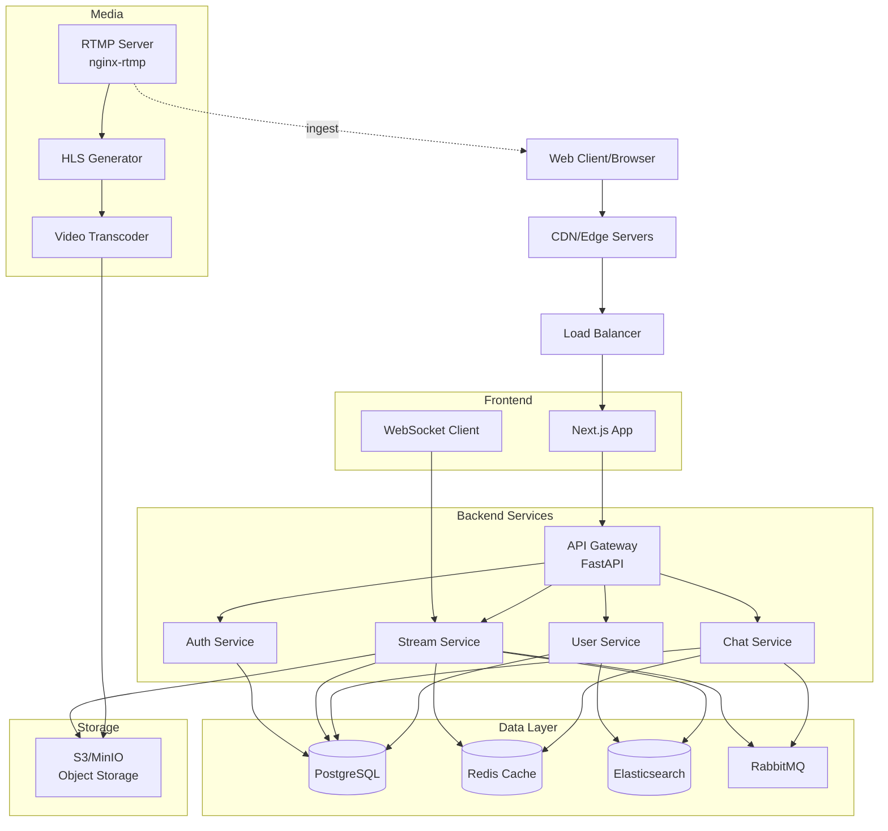
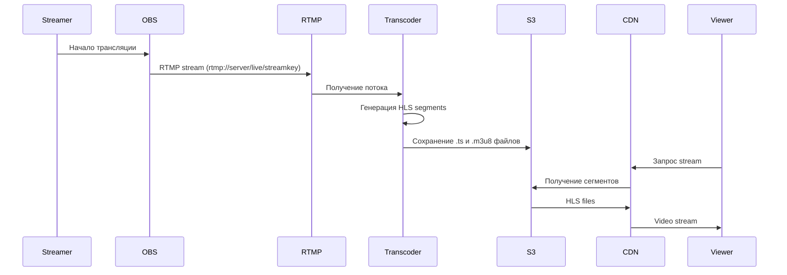
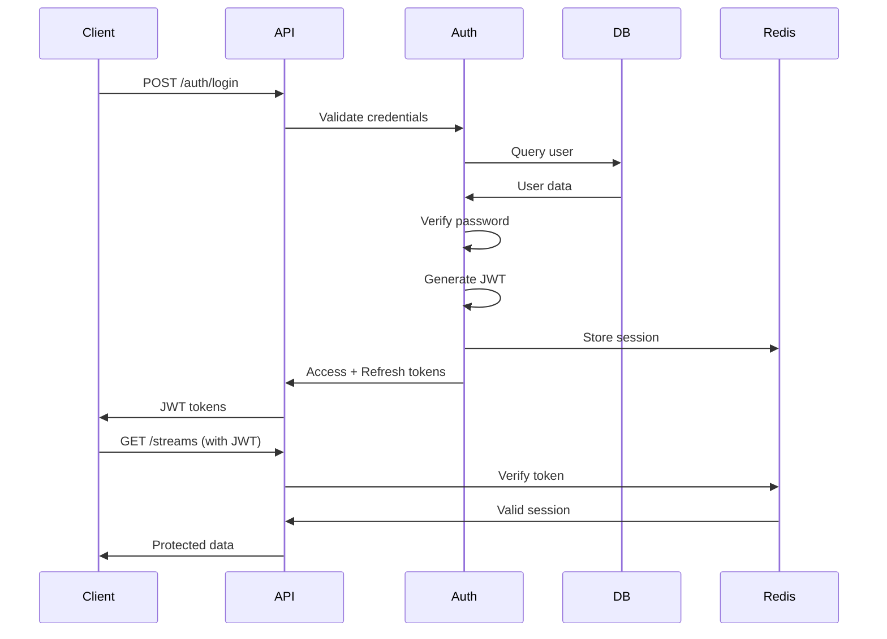
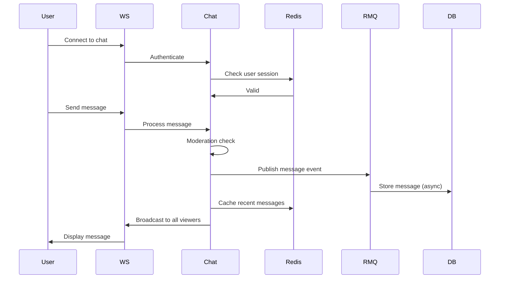

# Архитектура проекта

## Общий обзор

Leams построен на микросервисной архитектуре, обеспечивающей масштабируемость, гибкость и независимое развертывание компонентов.



---

## Компоненты системы

### Frontend Layer

#### Next.js Application
- **Технология**: React 19 + Next.js 14+ с App Router
- **Рендеринг**: Server-Side Rendering (SSR) + Client-Side Rendering (CSR)
- **Функции**:
    - Главная страница и навигация
    - Страницы каналов стримеров
    - Просмотр live трансляций
    - Интерактивный чат
    - Профили пользователей
    - Административная панель

#### Real-time Communication
- **WebRTC**: Для low-latency стриминга
- **WebSockets**: Для чата и уведомлений в реальном времени
- **HLS**: Для адаптивного стриминга на разных устройствах

---

### Backend Services

#### API Gateway (FastAPI)
- Единая точка входа для всех клиентских запросов
- Маршрутизация запросов к соответствующим микросервисам
- Rate limiting и throttling
- Аутентификация и авторизация JWT
- CORS конфигурация

```python
# Пример структуры API Gateway
from fastapi import FastAPI, Depends
from fastapi.middleware.cors import CORSMiddleware

app = FastAPI(title="Leams API Gateway")

# Роуты
app.include_router(auth_router, prefix="/auth")
app.include_router(users_router, prefix="/users")
app.include_router(streams_router, prefix="/streams")
app.include_router(chat_router, prefix="/chat")
```

#### Authentication Service
- Регистрация и авторизация пользователей
- OAuth 2.0 интеграция (Google, GitHub, Twitch)
- JWT токены (access + refresh)
- Password hashing (bcrypt)
- Email верификация
- 2FA (опционально)

#### Stream Service
- Управление live трансляциями
- Metadata стримов (название, категория, теги)
- VOD (Video on Demand) управление
- Аналитика просмотров
- RTMP stream keys генерация
- Webhooks для статуса стрима

#### Chat Service
- Real-time сообщения через WebSockets
- Модерация чата
- Emotes и badges
- Slow mode, subscriber-only mode
- Временные баны и таймауты
- Chat replay для VODs

#### User Service
- Профили пользователей
- Follow/Subscribe система
- Уведомления
- Настройки аккаунта
- Поиск пользователей

---

### Data Layer

#### PostgreSQL
**Основная реляционная БД для:**
- Пользователи и профили
- Стримы и VODs metadata
- Подписки и follows
- Транзакции и платежи
- Модерация и баны

**Схема БД** (основные таблицы):
```sql
-- Users
CREATE TABLE users (
    id UUID PRIMARY KEY,
    username VARCHAR(50) UNIQUE NOT NULL,
    email VARCHAR(255) UNIQUE NOT NULL,
    password_hash VARCHAR(255) NOT NULL,
    created_at TIMESTAMP DEFAULT NOW(),
    is_verified BOOLEAN DEFAULT FALSE
);

-- Streams
CREATE TABLE streams (
    id UUID PRIMARY KEY,
    user_id UUID REFERENCES users(id),
    title VARCHAR(255),
    category VARCHAR(100),
    is_live BOOLEAN DEFAULT FALSE,
    started_at TIMESTAMP,
    ended_at TIMESTAMP,
    viewer_count INTEGER DEFAULT 0
);

-- Followers
CREATE TABLE followers (
    follower_id UUID REFERENCES users(id),
    following_id UUID REFERENCES users(id),
    created_at TIMESTAMP DEFAULT NOW(),
    PRIMARY KEY (follower_id, following_id)
);
```

#### Redis
**In-memory cache для:**
- Сессии пользователей
- Real-time viewer counts
- Hot data (trending streams)
- Rate limiting counters
- WebSocket connection management

#### Elasticsearch
**Полнотекстовый поиск:**
- Поиск стримов по названию, категории
- Поиск пользователей
- Аналитика и логирование
- Recommendations engine

#### RabbitMQ
**Message broker для:**
- Асинхронная обработка событий
- Email уведомления
- Stream analytics обработка
- Video transcoding queue
- Webhook delivery

---

### Media Processing

#### RTMP Server (nginx-rtmp)
- Прием RTMP потоков от OBS/стримеров
- Конвертация в HLS формат
- Adaptive bitrate streaming
- Stream authentication

**Конфигурация nginx-rtmp:**
```nginx
rtmp {
    server {
        listen 1935;
        application live {
            live on;
            record off;
            
            # HLS
            hls on;
            hls_path /tmp/hls;
            hls_fragment 3s;
            hls_playlist_length 60s;
            
            # Authentication
            on_publish http://backend:8000/api/streams/verify;
        }
    }
}
```

#### Video Transcoder
- FFmpeg для транскодирования
- Множественные качества (1080p, 720p, 480p, 360p)
- Thumbnail генерация
- VOD обработка
- H.264/H.265 кодеки

#### Object Storage (S3/MinIO)
- Хранение VODs
- Thumbnails и previews
- User avatars и banners
- Chat emotes
- Backup и archiving

---

## Потоки данных

### Live Streaming Flow



### Authentication Flow



### Chat Message Flow



---

## Масштабирование

### Horizontal Scaling
- **Load Balancer**: NGINX/HAProxy для распределения нагрузки
- **Multiple API instances**: FastAPI workers за load balancer
- **Database replication**: PostgreSQL master-replica setup
- **Redis Cluster**: Для distributed caching
- **CDN**: CloudFlare/Fastly для статического контента

### Vertical Scaling
- Увеличение ресурсов для video transcoding серверов
- Больше памяти для Redis кэша
- SSD storage для базы данных

### Caching Strategy
```
Browser → CDN → Load Balancer → Redis → PostgreSQL
        Cache      Cache          Cache      Source
```

---

## Безопасность

### API Security
- JWT authentication с коротким TTL
- Refresh token rotation
- Rate limiting (100 req/min per IP)
- Input validation (Pydantic)
- SQL injection protection (SQLModel ORM)
- XSS protection (sanitization)

### Stream Security
- Unique stream keys
- RTMP authentication webhook
- IP whitelisting для streamers
- DMCA takedown system

### Data Protection
- HTTPS/TLS everywhere
- Encrypted passwords (bcrypt)
- Encrypted sensitive data at rest
- Regular backups
- GDPR compliance готовность

---

## Мониторинг и логирование

### Metrics Collection
- Prometheus для метрик
- Grafana для визуализации
- Custom dashboards (viewers, streams, API latency)

### Logging
- Structured logging (JSON format)
- ELK Stack (Elasticsearch, Logstash, Kibana)
- Log levels: DEBUG, INFO, WARNING, ERROR
- Distributed tracing (Jaeger/OpenTelemetry)

### Alerting
- PagerDuty/Slack интеграция
- Алерты на:
    - High error rates
    - Service downtime
    - Disk space warnings
    - Database connection issues

---

## Deployment

См. [Руководство по развертыванию](../DEPLOYMENT.md) для детальных инструкций.

### Development
```bash
docker-compose up
```

### Staging
- Docker Swarm или Kubernetes
- CI/CD через GitHub Actions

### Production
- Kubernetes cluster (EKS/GKE/AKS)
- Terraform для Infrastructure as Code
- Blue-green deployments
- Auto-scaling на основе метрик
