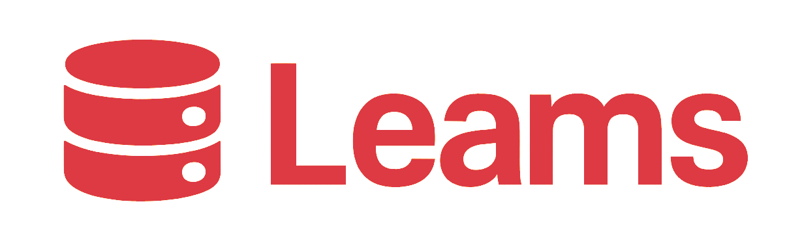

<!-- TODO: In the future transfer from material mkdocs to Zensical -->
<!-- https://zensical.org/ -->
<style> h1:first-of-type { display:none } </style> 
<a href="http://localhost:3000/"></a>

### <div style="text-align: center;"> **Leams** — <span style="color: #dd3a44;">A first open-source streaming platform</span> </div>

<!-- TODO: Make here own .github-actions -->
<p align="center">
    <a href="https://github.com/fastapi/fastapi/actions?query=workflow%3ATest+event%3Apush+branch%3Amaster" target="_blank">
        
    </a>
    <a href="https://coverage-badge.samuelcolvin.workers.dev/redirect/fastapi/fastapi" target="_blank">
        
    </a>
    <a href="https://pypi.org/project/fastapi" target="_blank">
        
    </a>
    <a href="https://pypi.org/project/fastapi" target="_blank">
        
    </a>
</p>

---

## **Project goals**

*__Short-term__*
- Provide a minimal, working streaming experience (broadcast + viewer playback).
- Build a clean web UI and a simple streaming backend API.
- Publish clear docs and a contributor-friendly repo.

*__Mid-term__*
- Add robust chat, moderation tools, and channel settings.
- Implement authentication and creator monetization options (subscriptions, tips).
- Offer optional, transparent ad models that creators opt into.

*__Long-term__*
- Support federated / decentralized streaming and content portability.
- Provide a plugin system or API so communities can customize rules and UX.
- Build a sustainable governance model that protects creators.

---

## Key features (planned)

- Live streaming (RTMP ingest / WebRTC support)
- Low-latency viewer playback
- Persistent channel pages with VODs
- Chat with moderation controls and roles
- Creator dashboards: stream key, stats, monetization options
- Privacy-first defaults and opt-in telemetry
- Developer-friendly APIs and extensible architecture


---

## Roadmap / milestones

- M1 — MVP: RTMP ingest, simple player, channel pages, basic chat
- M2 — UX & Auth: user accounts, channel settings, stream management
- M3 — Moderation & Monetization: roles, mod tools, tips/subscriptions
- M4 — Extensibility: plugins, third-party integrations, API docs
- M5 — Federation & Portability: cross-platform streaming/identity options

---

## **Quick Installation**

```console
sudo pacman -S docker
cd ~/
git clone https://github.com/azlamire/Leams
sudo docker compose up
```

---

## Contribution

You’re welcome to contribute. Suggested ways to help:
1. Open issues for bugs, missing features, or design suggestions.
2. Submit PRs for small improvements (README, docs, UI fixes).
3. Implement an outlined milestone (pick an issue labeled "help wanted" / "good first issue").

<!-- TODO: Make this  -->
- 📚 [Full API Reference (TypeDoc)]()
<!-- TODO: Make a full guide of installation and small structure of this one -->
- 🚀 [Setup & Installation]()
- 🐛 [Report a Bug](https://github.com/azlamire/Leams/issues)
- 💡 [Request a Feature](https://github.com/Dambarioid/leams/issues/new?template=feature_request.md)
- 💬 [Join our Discord](https://discord.gg/leams)
<!-- TODO: Make this  -->
- 🎨 [Design System]()

---

## **License**

This project is licensed under the terms of the [AGPL-3.0-or-later](https://spdx.org/licenses/AGPL-3.0-or-later.html) license.

---
